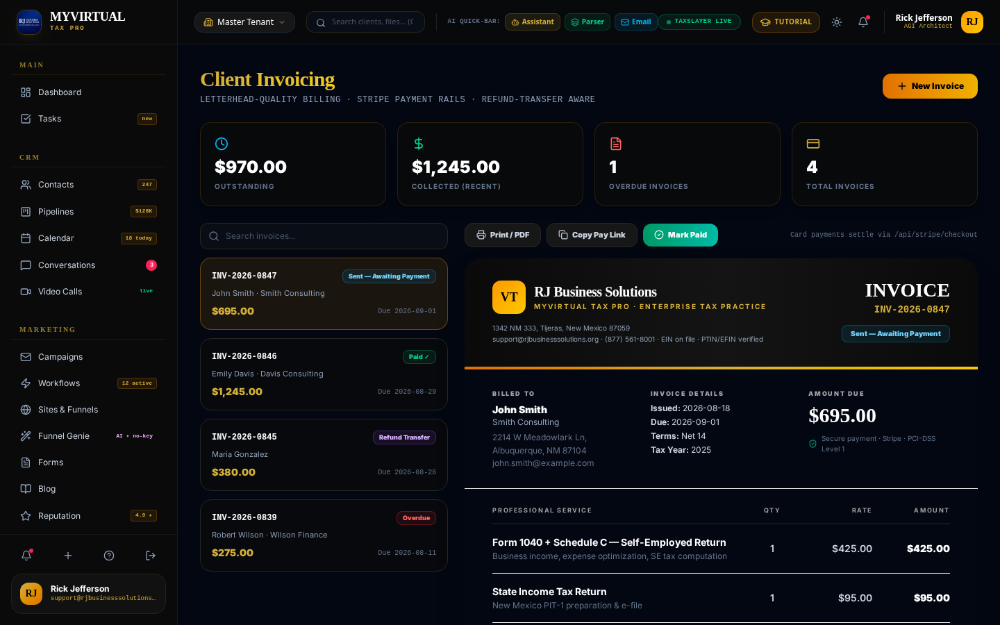

# Tax Pro Hub University — Client Portal Guide

**A step-by-step guide for tax clients of your practice**
Give this document (rebranded with your firm's name/logo) to every client.
Version 2.0.4 · Filing season 2026

---

## Welcome!

Your tax professional uses **Tax Pro Hub University**, a secure practice platform, to manage your return from first document to final refund. This guide shows you everything you'll do as a client: uploading documents, booking appointments, messaging your preparer, joining video meetings, and paying invoices.

> **Your data is protected.** Documents you upload are processed with bank-grade security aligned with IRS Publication 4557 safeguards. Your Social Security number is always masked in the system (only the last 4 digits are visible to staff).

---

## 1. Getting Your Portal Invitation

1. Your preparer adds you as a client and sends an invitation by **email or text message**.
2. Tap the secure link, verify your identity, and set your password.
3. Bookmark the portal — you'll use it all season.

**Didn't get the invite?** Check spam, then call your preparer's office. (For practices on RJ Business Solutions support: (877) 561-8001.)

---

## 2. Uploading Your Tax Documents

This is the most important thing you'll do — and the platform makes it effortless.

1. From the portal home, choose **Upload Documents**.
2. Drag in files or snap **photos with your phone** — W-2s, 1099s, mortgage statements (1098), tuition statements (1098-T), Social Security statements (SSA-1099), K-1s, IDs. PDFs and photos both work.
3. You can upload **an entire stack at once**. The system's document intelligence automatically:
   - Reads every document (W-2 boxes, 1099 amounts, withholding),
   - Recognizes **which documents are yours**,
   - Sorts them into the right folders (Income, Deductions, Education, …),
   - Notifies your preparer that your documents arrived.
4. You'll see a confirmation for each file. That's it — no forms to fill out about what you uploaded.

**Photo tips for best results:**
- Lay the document flat, good lighting, all four corners in frame.
- One document per photo.
- Avoid shadows across the numbers.

### What documents do I need?

| If you have… | Upload… |
|---|---|
| A job | W-2 (from each employer) |
| Freelance/gig income | 1099-NEC, 1099-K, expense records |
| Bank interest / investments | 1099-INT, 1099-DIV, 1099-B |
| Retirement income | 1099-R, SSA-1099 |
| A mortgage | Form 1098 |
| College tuition | Form 1098-T |
| Unemployment | 1099-G |
| Partnership/S-corp ownership | Schedule K-1 |
| First year with this preparer | Last year's tax return + photo ID |

---

## 3. Booking an Appointment

1. Choose **Book Appointment** (or use the booking link your preparer texts you).
2. Pick **in-person, phone, or video**.
3. Choose an open time slot — confirmations and reminders arrive by email and text automatically.

**Need to reschedule?** Use the link in your reminder message, or just reply to the text.

---

## 4. Messaging Your Preparer

- Every email or text you receive from the practice can simply be **replied to** — your reply lands in your preparer's inbox instantly and pauses any automated reminders.
- For document questions, message first before mailing anything physical.

---

## 5. Video Tax Appointments

1. At your appointment time, tap the **video link** in your confirmation.
2. Allow camera/microphone access in your browser — no app installation needed.
3. Your preparer can **share their screen** to walk you through your return line by line before filing.

---

## 6. Reviewing & Approving Your Return

1. When your return is ready, you'll get a notification to **review it in the portal**.
2. Open the review copy, check names, SSNs (last-4), bank info for direct deposit, and the refund/balance-due amount.
3. **E-sign Form 8879** (IRS e-file authorization) right in the portal — both spouses sign if filing jointly.
4. Your preparer e-files. You'll be notified when the IRS **accepts** your return.

**Track your refund:** after acceptance, use IRS *Where's My Refund* (irs.gov/refunds) — most refunds arrive within 21 days of acceptance.

---

## 7. Paying Your Invoice

Your invoice arrives by email/text with a secure payment link.

Three ways to pay:
1. **Card / bank (online)** — tap **Pay Invoice** in the email; payments are processed by Stripe (PCI-DSS Level 1).
2. **ACH transfer** — account details are printed on the invoice.
3. **Refund Transfer** — have fees deducted **from your refund** so you pay nothing today (a consent form under IRS §7216 rules will be provided; bank processing fees may apply).

You'll receive a paid receipt automatically.

---

## 8. After Filing — What to Expect

- **IRS acceptance notice** — usually within 24–48 hours of e-file.
- **Refund** — typically within 21 days (EITC/ACTC refunds are held by law until mid-February).
- **Your documents** stay in your portal — download your return copy anytime, year-round.
- **IRS letters?** Don't panic and don't respond alone — upload a photo of any IRS notice to the portal immediately; your preparer will classify it and respond for you.

---

## 9. Staying Secure

- Never send your SSN or bank details by regular email or text — **always use the portal**.
- The practice will never call demanding immediate payment by gift card or wire — that's a scam, hang up.
- Use a strong, unique password for your portal login.
- Log out on shared computers.

---

## 10. Quick FAQ

**Q: I forgot my password.**
Use *Forgot Password* on the sign-in page; a reset link is sent to your email.

**Q: I uploaded the wrong file.**
Message your preparer through the portal — they can remove it.

**Q: Can my spouse have their own login?**
Yes — ask your preparer to send a second invitation.

**Q: How do I get last year's return?**
It's in your portal documents, available for download 24/7.

**Q: What if I'm missing a W-2?**
Contact the employer first; if it's February and still missing, your preparer can help with IRS Form 4852 substitute procedures.

---

**Questions?** Contact your tax office directly, or the platform support line:
support@rjbusinesssolutions.org · (877) 561-8001

*© 2026 RJ Business Solutions. Practices licensed to resell Tax Pro Hub University may rebrand and redistribute this guide to their clients.*
