# Tax Pro Hub University — Complete User Manual (Team Edition)

**RJ Business Solutions · Enterprise Tax Practice Platform**
Version 2.0.4 · Tax Year 2025 (filing season 2026) · Last updated 2026-08-22
Support: support@rjbusinesssolutions.org · (877) 561-8001

---

## Table of Contents

1. [What Is Tax Pro Hub University?](#1-what-is-mytax-pro-hub-university)
2. [First Sign-In & the 64-Step Interactive Tutorial](#2-first-sign-in--the-64-step-interactive-tutorial)
3. [The Command Dashboard](#3-the-command-dashboard)
4. [Contacts & CRM](#4-contacts--crm)
5. [Deal Pipelines](#5-deal-pipelines)
6. [Tax Module & IRS TY2025 Intelligence](#6-tax-module--irs-ty2025-intelligence)
7. [Document Intelligence — OCR & Smart Auto-Filing](#7-document-intelligence--ocr--smart-auto-filing)
8. [Unified Inbox (Conversations)](#8-unified-inbox-conversations)
9. [Campaigns & the Drip Sequence Library](#9-campaigns--the-drip-sequence-library)
10. [Automation Workflows](#10-automation-workflows)
11. [Funnels & the AI Campaign Architect](#11-funnels--the-ai-campaign-architect)
12. [Calendar & Booking](#12-calendar--booking)
13. [Video Consultation Suite](#13-video-consultation-suite)
14. [Client Invoicing & Billing](#14-client-invoicing--billing)
15. [Analytics](#15-analytics)
16. [Agency Admin, Sub-Accounts & Payouts](#16-agency-admin-sub-accounts--payouts)
17. [Settings](#17-settings)
18. [Cloudflare Backend & Integrations](#18-cloudflare-backend--integrations)
19. [Compliance & Security](#19-compliance--security)
20. [Help Center & Support](#20-help-center--support)

---

## 1. What Is Tax Pro Hub University?

Tax Pro Hub University is an all-in-one **enterprise tax practice operating system**: CRM, on-device document OCR, IRS tax-year intelligence, drip marketing, funnel building, automations, video consultations, client invoicing, and multi-location agency payouts — all in one platform, with every backend integration built on **Cloudflare's edge network**.

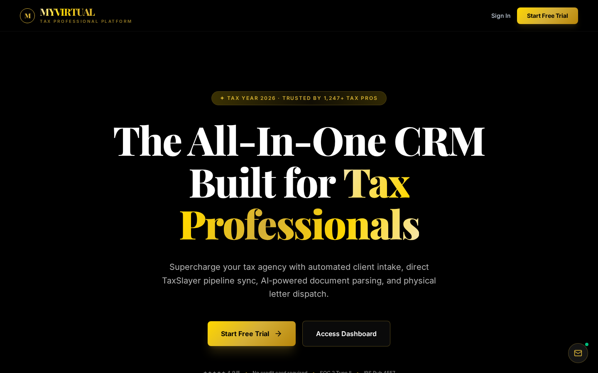

It is designed to be white-labeled and resold: a **service bureau** model where you operate sub-accounts (locations/franchisees), each with its own branding, clients, and payout tracking.

---

## 2. First Sign-In & the 64-Step Interactive Tutorial

On your very first visit, the platform greets you with the tutorial invitation:

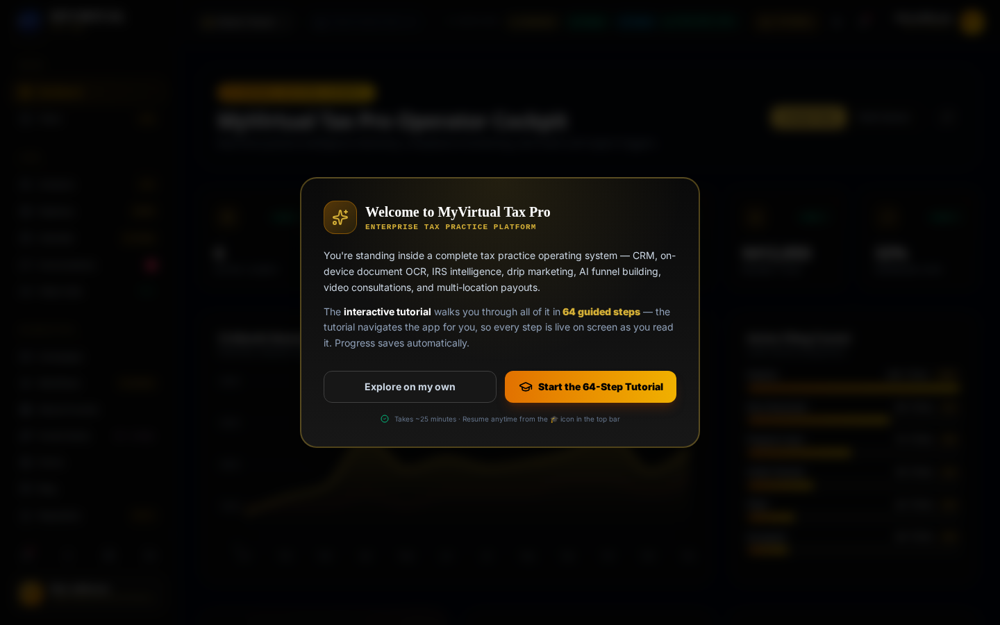

- **Start the 64-Step Tutorial** — a guided, route-aware tour. The tutorial *navigates the app for you*: every step's page is live on screen while the docked card explains it.
- **Explore on my own** — dismisses the invite. You can reopen the tutorial anytime from the **🎓 graduation-cap icon in the top bar**.

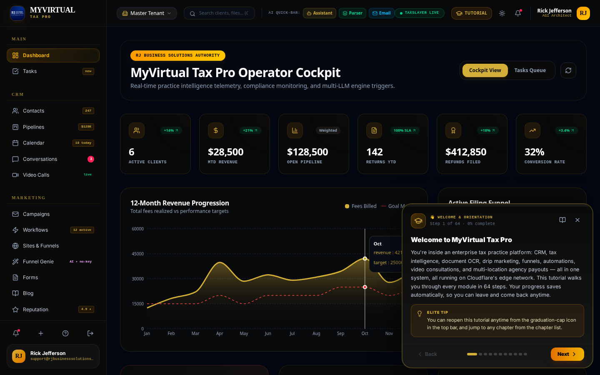

**Tutorial mechanics:**
- 64 steps across 11 chapters (Welcome, Dashboard, CRM, Tax Module, OCR, Campaigns, Funnels & AI, Automations, Video, Agency & Payouts, Compliance & Go-Live).
- Navigate with **Next / Back** buttons or **← → arrow keys**; press **Esc** to close.
- Click the **book icon** on the tutorial card to open the chapter picker and jump anywhere.
- Progress saves automatically (per browser). Completing all 64 steps unlocks the certification screen.

---

## 3. The Command Dashboard

Route: **Dashboard** (first item in the sidebar).

The Operator Cockpit surfaces, in real time:

| Widget | What it tells you |
|---|---|
| KPI cards | Active clients, MTD revenue, open pipeline value, returns YTD, refunds filed, conversion rate |
| 12-Month Revenue Progression | Fees billed vs. goal markers |
| Active Filing Funnel | Lead volume from Inquiry → Docs Received → Preparer Sync → Under Review → Filed → Accepted |
| Cockpit View / Tasks Queue toggle | Switch between telemetry and your actionable task list |

**Top bar quick access:** tenant switcher, global search, AI Quick-Bar (Assistant, Parser, Email, TaxSlayer Live), the **Tutorial** launcher, dark-mode toggle, and notifications.

---

## 4. Contacts & CRM

Route: **Contacts** (CRM section).

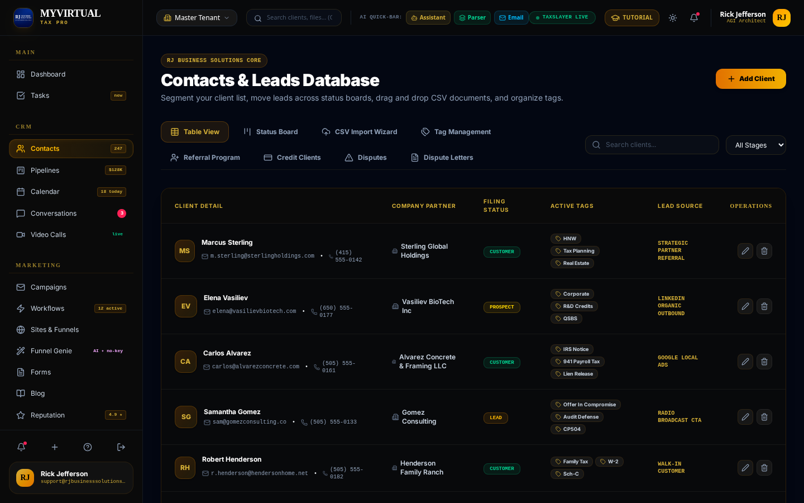

**Core operations:**
1. **Add a contact** — click *Add Contact*, fill identity, contact info, tags.
2. **Open a record** — click any row for the full profile: activity timeline, custom fields (including tax data written by the OCR engine), deals, documents, and communication history.
3. **Tags & segments** — tag clients (`w2-client`, `self-employed`, `prior-year`, …). Campaigns and workflows target these tags.
4. **Growth tabs** — referral tracking and reputation tools live inside the Contacts area.

Contacts are automatically **created or enriched by the Document Intelligence engine** (Section 7) — dropping a W-2 can create the client record for you.

---

## 5. Deal Pipelines

Route: **Pipelines**.

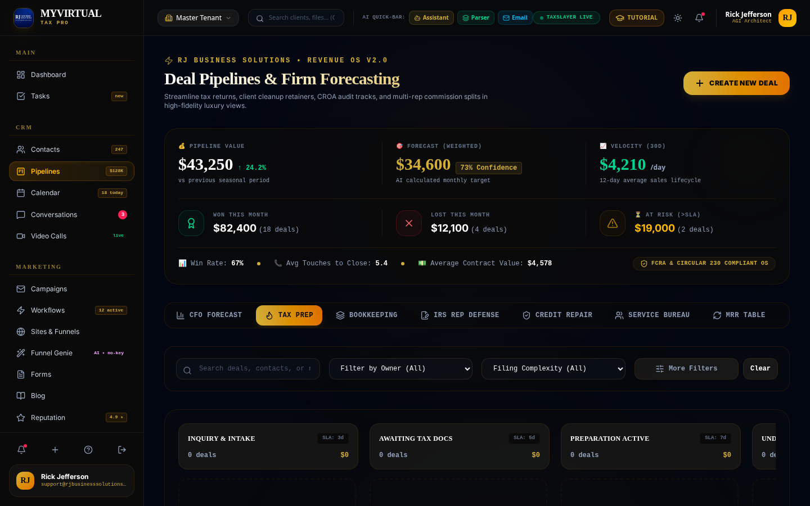

- Kanban board of every engagement, staged from intake through filed & paid.
- Drag cards between stages; the pipeline value in the sidebar badge updates live.
- Deals are auto-created by the OCR engine (with detected income and a fee estimate) when you enable *Also open Tax-Prep Deal* during document injection.

---

## 6. Tax Module & IRS TY2025 Intelligence

Route: **Tax Clients** for the roster, **Tax Module** for preparation intelligence.

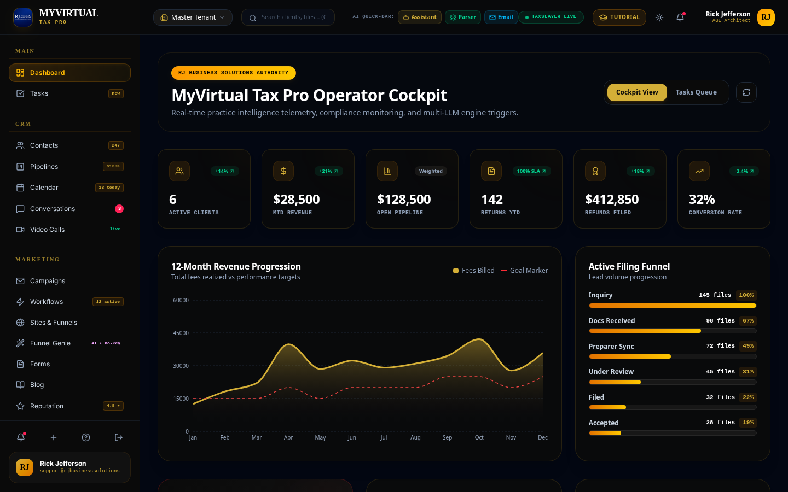

The Tax Module's tabs (deep-linkable via `?tab=`) include return workflow tracking, due-diligence checklists, and the **IRS TY2025 Intelligence Engine**:

Built-in TY2025 reference data includes:
- Standard deduction: **$15,750 single / $31,500 MFJ / $23,625 HOH**
- Child Tax Credit: **$2,200** per child ($1,700 refundable ACTC)
- Max EITC: **$8,046** (3+ children)
- SE tax **15.3%**, Social Security wage base **$176,100**
- §6695 preparer due-diligence penalty: **$635 per failure** (Form 8867)
- Estimated-tax safe harbor: **100% / 110%** of prior-year liability

---

## 7. Document Intelligence — OCR & Smart Auto-Filing

Route: **Funnel Genie → Documents** (or the **Parser** button in the top-bar AI Quick-Bar).

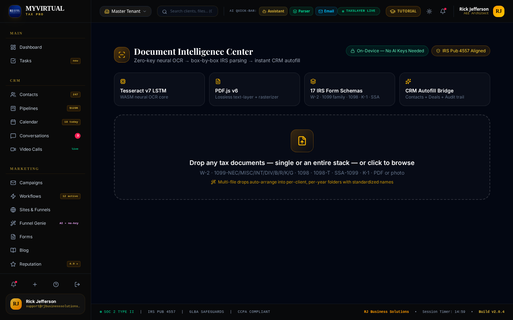

This is the flagship intake engine — **zero API keys required**; OCR runs entirely on-device (Tesseract v7 LSTM via WASM + PDF.js v6), so client documents **never leave the browser**.

### Single-document flow
1. **Drop** any W-2, 1099 (NEC/MISC/INT/DIV/B/R/K/G), 1098, 1098-T, SSA-1099, or K-1 — PDF or photo.
2. Watch the neural OCR progress bar; then review **box-by-box field extraction** with per-field confidence bars.
3. Review the **Smart Filing Plan** panel: client match (email → SSN last-4 → name), destination folder, standardized file name, and the recommended next preparation action.
4. Click **Inject Fields Into CRM** — the contact is created or enriched, every field lands in custom fields, an audit activity is logged, and (optionally) a tax-prep deal opens in the pipeline.

### Batch auto-arrange (drop an entire stack)
Drop **multiple files at once** and the Smart Filing Engine automatically:
- **Matches each document to its client** (email exact → SSN last-4 → fuzzy name → flags new clients)
- **Files it into the right folder**: Income · Deductions & Credits · Retirement & Investments · Business Records · Education · Identity & Verification
- **Renames it** to the audit-standard convention: `ClientName_TY2025_W2_Employer.pdf`
- Marks high-confidence documents **Auto-Process Eligible** — click **Auto-Process** once and every eligible document injects into the CRM in a single pass.

The **Auto-Arranged Filing Cabinet** shows the full per-client, per-folder tree; click any file to inspect its extraction before or after processing.

---

## 8. Unified Inbox (Conversations)

Route: **Conversations**.

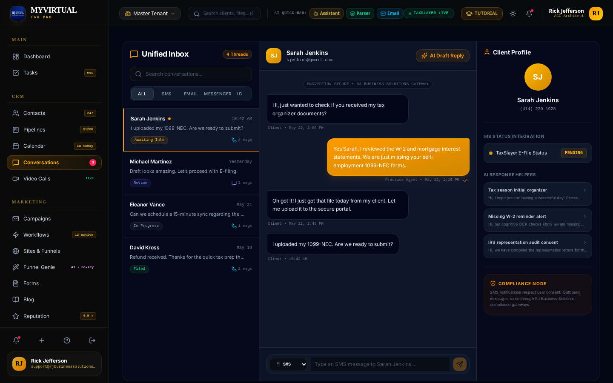

- Every SMS, email, and portal message in one threaded inbox.
- Reply in-channel; replies automatically **exit clients from active drip sequences** (exit-on-reply logic).
- Unread badge appears on the sidebar item.

---

## 9. Campaigns & the Drip Sequence Library

Route: **Campaigns**.

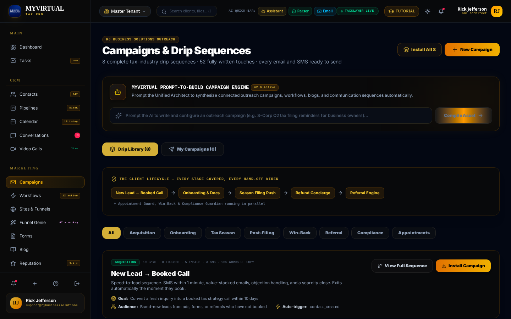

**The Drip Library ships 8 professionally-written sequences (52 total touches)** covering the full client lifecycle: new-lead nurture, document chase, appointment no-show recovery, post-filing referral, extension deadline, quarterly estimates, prior-client win-back, and off-season advisory.

Every sequence step includes: send day, channel (email/SMS), full copy with merge tokens (`{{firstName}}`, `{{bookingLink}}`, `{{preparerName}}`), CTA, **exit conditions** (reply / booked / docs uploaded / filed), and a strategy note explaining *why* the touch exists.

**To launch:** open a sequence → review each touch → *Install* → choose the target tag/segment → activate. Sending is dispatched through the Cloudflare Worker (`/api/sms/send`, `/api/email/send`).

---

## 10. Automation Workflows

Route: **Workflows**.

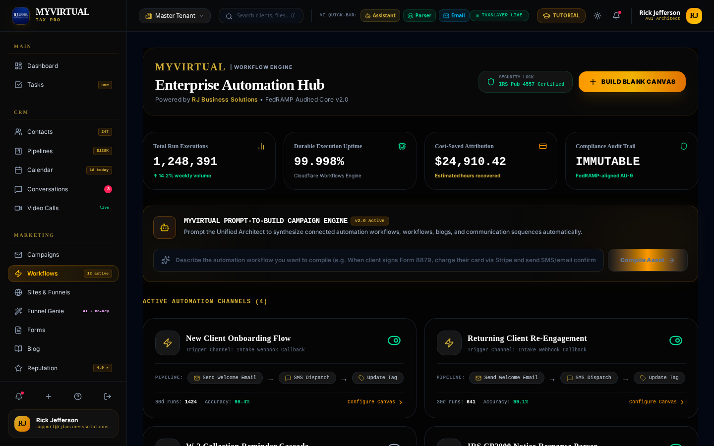

Trigger → action automation recipes (12+ pre-built) covering lead routing, document-received acknowledgments, review requests, filing-status notifications, and payment follow-ups. Build custom flows from triggers (form submitted, tag added, stage changed, payment received) and actions (send email/SMS, create task, move stage, notify team).

---

## 11. Funnels & the AI Campaign Architect

Routes: **Sites & Funnels**, **Funnel Genie** (AI).

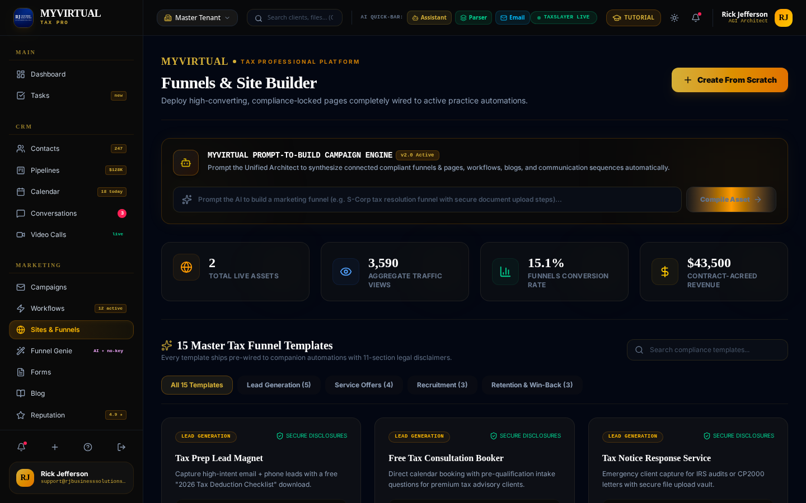

The **AI Campaign Architect** generates an entire go-to-market suite from one theme prompt:

1. Enter a campaign theme (e.g., "Self-employed quarterly estimates push").
2. The Architect compiles: **landing funnel** (headline, bullets, CTA, compliance footer) → **intake form** → **automation workflow** → **email broadcast** (full multi-paragraph copy with TY2025 figures) → **complete 6-touch drip sequence** (Day 0 → Day 12, email + SMS, exit-on-reply/booked logic, strategy notes on every step) → **SMS** → **long-form SEO blog article** (~700 words with real IRS numbers).
3. Preview every node in the compile view — including the full drip sequence panel.
4. Click **Activate** — all assets install into Funnels, Forms, Workflows, Campaigns, and Blog simultaneously, fully wired.

---

## 12. Calendar & Booking

Route: **Calendar**.

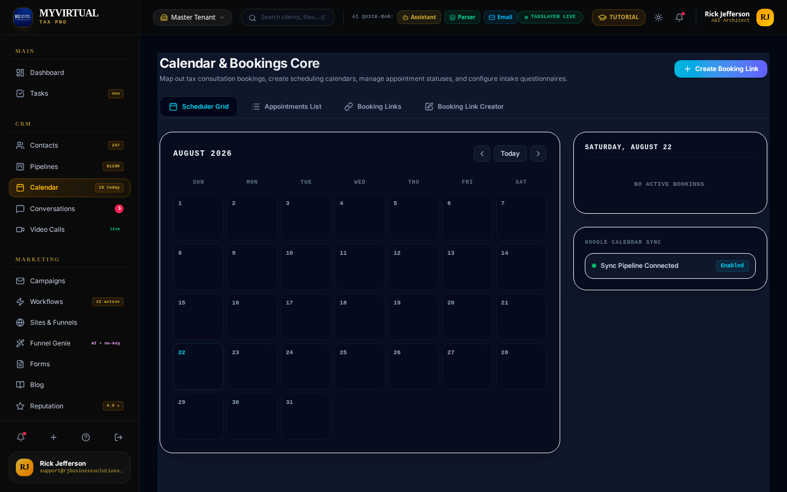

Appointment scheduling with day/week/month views. Bookings feed automation triggers (booked-appointment exits drip sequences; no-shows trigger the recovery sequence).

---

## 13. Video Consultation Suite

Route: **Video Calls**.

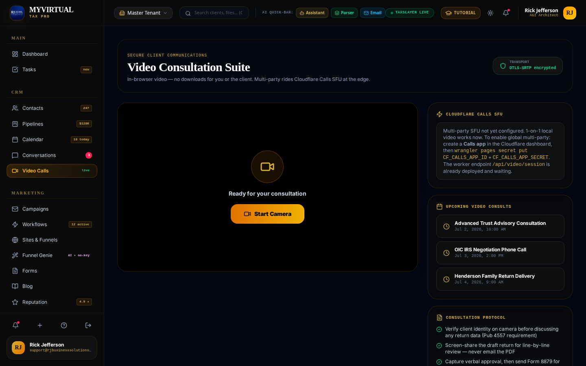

In-platform video rooms for client consultations, screen-share document review, and recorded sessions. Session tokens are provisioned by the Cloudflare Worker (`/api/video/session`).

---

## 14. Client Invoicing & Billing

Route: **Invoicing** (sidebar, `$ due` badge).

Letterhead-quality billing built for a professional practice:

- **12-service catalog** with standard rates (1040 $285 · 1040+Sch C $425 · 1120-S $895 · 1065 $795 · state $95 · amendments, notices, planning, bookkeeping, Audit Shield, credit repair).
- **Print-ready invoice document**: firm letterhead, billed-to block, line items, discounts, tax-exempt notes, three payment rails (Stripe card link · ACH · **Refund Transfer** with §7216 consent note), terms and footer.
- **Actions**: Print/PDF (prints only the white invoice document, perfectly formatted), Copy Pay Link, Send to Client, Mark Paid.
- **New Invoice** modal: pick the client, click services from the catalog, adjust qty/rates, apply discounts — the total computes live.
- Status tracking: Draft → Sent → Paid / Overdue / Refund Transfer.

Card payments settle through the Cloudflare Worker's Stripe integration (`/api/stripe/checkout`); agency revenue-share flows through Stripe Connect (`/api/stripe/connect`).

---

## 15. Analytics

Route: **Analytics**.

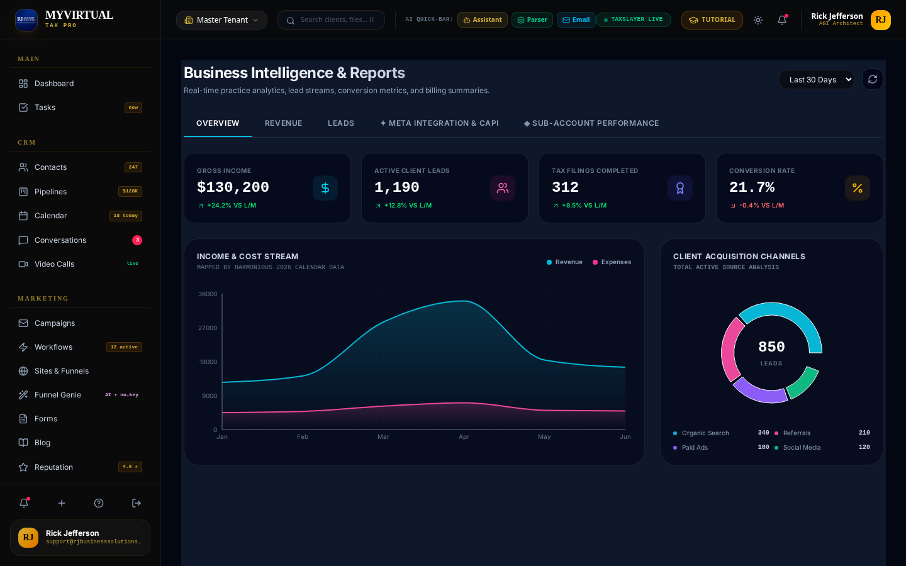

Revenue, campaign performance (open/click/reply rates per sequence), pipeline conversion, and preparer productivity. Deep-linkable tabs via `?tab=`.

---

## 16. Agency Admin, Sub-Accounts & Payouts

Route: **Admin** (agency owners only).

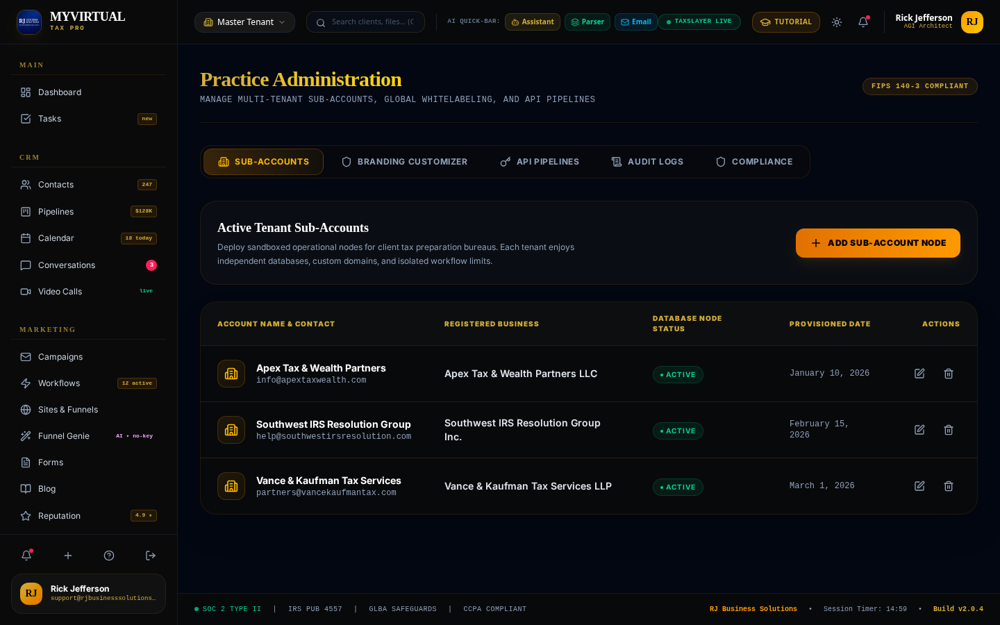

The **service-bureau layer**:
- **Sub-accounts** — spin up locations/franchisees with isolated branding, clients, and pipelines; switch tenants from the top-bar tenant picker.
- **Payout engine** — per-return and revenue-share accrual (`/api/payouts/accrue`), Stripe Connect onboarding for sub-account owners, payout statements.
- **Referral links** — trackable partner links (`/api/referrals/link`).
- **User & role management** — preparer, reviewer, admin, owner roles.

---

## 17. Settings

Route: **Settings**.

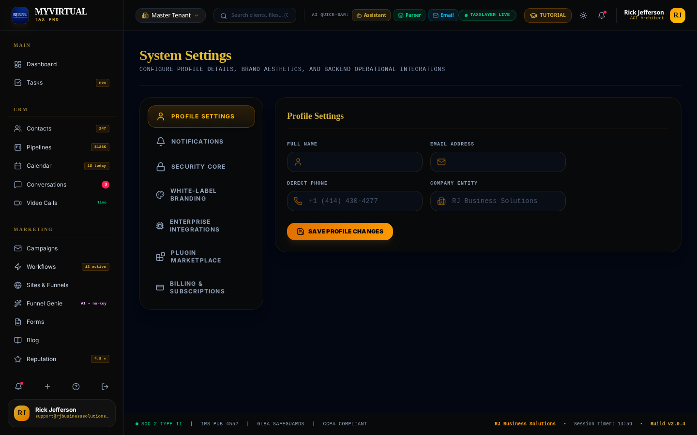

Tabs (deep-linkable): Profile, Business/Branding (white-label logo, colors, letterhead identity used on invoices), Team, Notifications, Integrations, Subscription billing, and Security.

---

## 18. Cloudflare Backend & Integrations

Everything server-side runs as a **Cloudflare Worker** (`functions/api/[[route]].ts`), deployable with `wrangler`:

| Endpoint | Purpose | Secret(s) required |
|---|---|---|
| `POST /api/sms/send` | Twilio SMS dispatch | `TWILIO_ACCOUNT_SID`, `TWILIO_AUTH_TOKEN`, `TWILIO_FROM` |
| `POST /api/email/send` | Transactional + campaign email | `RESEND_API_KEY` (or SMTP relay vars) |
| `POST /api/stripe/checkout` | Invoice/card payments | `STRIPE_SECRET_KEY` |
| `POST /api/stripe/connect` | Sub-account payout onboarding | `STRIPE_SECRET_KEY` |
| `POST /api/stripe/webhook` | Payment event ingestion | `STRIPE_WEBHOOK_SECRET` |
| `POST /api/video/session` | Video room tokens | video provider key |
| `POST /api/llm/chat` | AI assistant completions | `LLM_API_KEY` |
| `POST /api/payouts/accrue` | Payout ledger accrual | — |
| `POST /api/referrals/link` | Partner referral links | — |
| `POST /api/notices/classify` | IRS notice triage | — |
| `GET /api/health` | Uptime probe | — |

Missing secrets return a **graceful 501 naming the exact secret to configure** — the UI keeps working and tells you what to wire. Set secrets with `wrangler secret put <NAME>` and deploy with `wrangler deploy`.

---

## 19. Compliance & Security

- **On-device OCR** — tax documents are processed in the browser; nothing is uploaded for parsing.
- **IRS Pub 4557 / GLBA Safeguards** alignment posture; SOC 2 Type II operational controls listed in the footer bar.
- SSNs are masked to last-4 in the CRM (`•••1234`).
- §7216 consent language is embedded in Refund Transfer invoice notes.
- Due-diligence (Form 8867) checklists live in the Tax Module; the $635-per-failure penalty is surfaced in the intelligence engine.

---

## 20. Help Center & Support

Route: **Help Center** (sidebar) or the **?** icon.

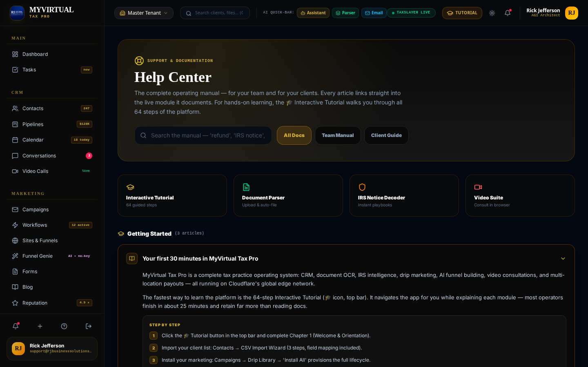

- **22 searchable articles**: 14 team-operations articles + 8 client-portal articles.
- Filter by audience (*Team Manual* / *Client Guide*), search by keyword, and use **Open in App** deep links to jump straight to the feature being described.
- Restart the **72-step interactive tutorial** anytime from the 🎓 icon.

**Support:** support@rjbusinesssolutions.org · (877) 561-8001
RJ Business Solutions · 1342 NM 333, Tijeras, New Mexico 87059

---

## 21. Growth Engine — The Modules No Competitor Has

### 21.1 Bank Products Center (`/bank-products`)
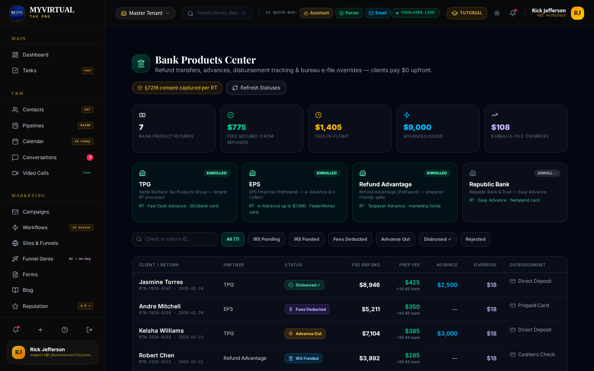

Refund transfers, same-day advances ($500–$7,000) and disbursement tracking across **TPG, EPS Financial, Refund Advantage and Republic Bank**. Status pipeline: *IRS Pending → IRS Funded → Fees Deducted → Disbursed*. The **Pre-Approved Advance Desk** lists clients who pre-qualified through the Advance lead magnet with banking info already captured and verified. Every downline bank-product return accrues a **per-return bureau override** to the platform owner automatically.

### 21.2 Recruiting Network (`/network`)
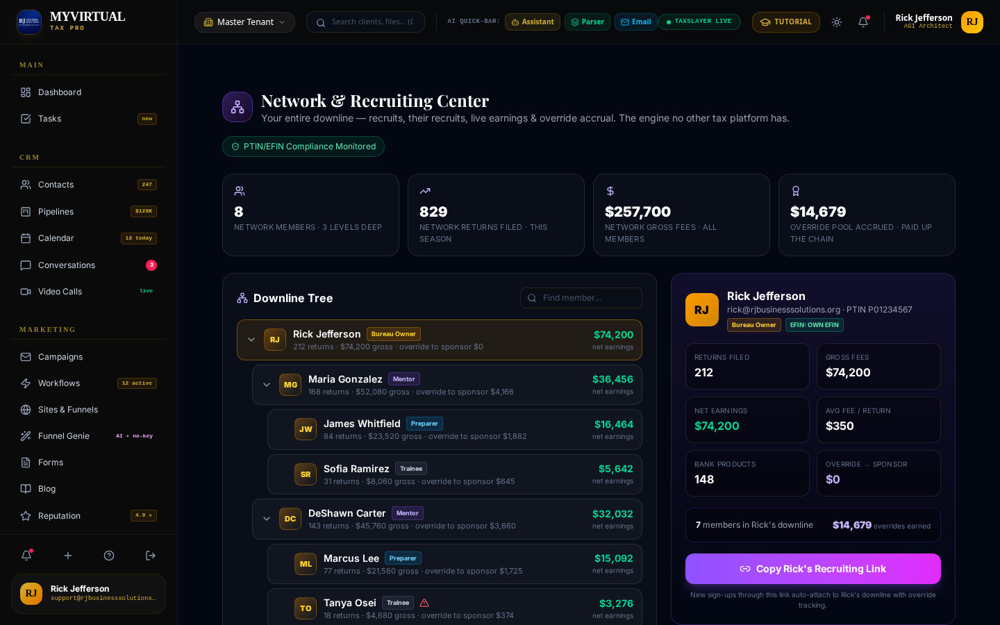

Live downline monitoring: expandable 3-level tree of mentors, preparers and trainees with returns filed, gross fees, net earnings, and override flow up the chain per member. **Copy Recruiting Link** generates personal signup links that auto-attach new recruits to the right sponsor. PTIN/EFIN compliance holds are flagged in-tree.

### 21.3 Credit Repair Center (`/credit-repair`)
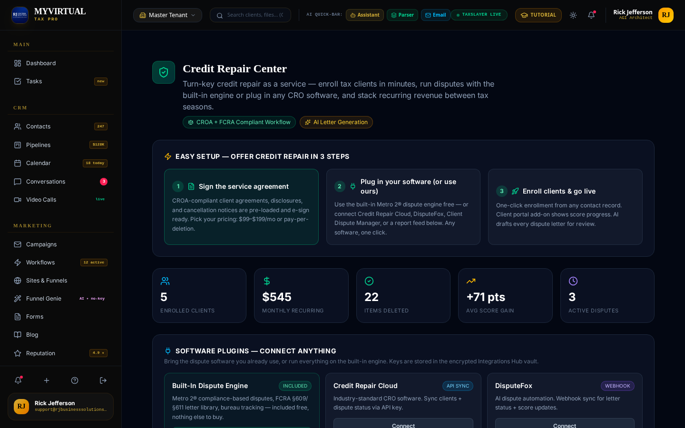

Turn-key credit repair as a service — 3-step activation: (1) CROA-compliant agreements are pre-loaded and e-sign ready, (2) use the built-in **Metro 2® dispute engine** with FCRA §609/§611 letter library *or* plug in Credit Repair Cloud / DisputeFox / Client Dispute Manager / Array report feeds, (3) enroll clients one-click from any contact record. Roster tracks score journeys, deletions and $99–$199/mo recurring fees.

### 21.4 Lead Magnets Studio (`/lead-magnets`)
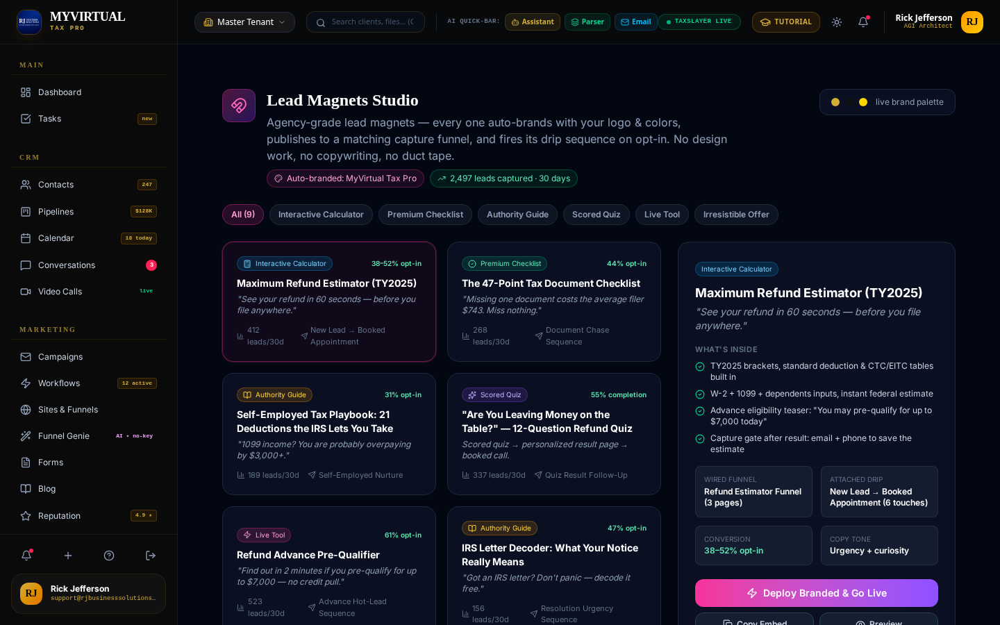

Nine agency-grade magnets (Refund Estimator, 47-Point Checklist, Self-Employed Playbook, Refund Quiz, **Advance Pre-Qualifier**, IRS Letter Decoder, Business Survival Kit, Referral Reward Card, Credit Score Simulator). Every magnet auto-brands with the tenant's logo/colors, deploys to a matched capture funnel, and attaches its drip sequence on opt-in. Embed code drops any magnet on any website.

### 21.5 Integrations Hub (`/integrations`)
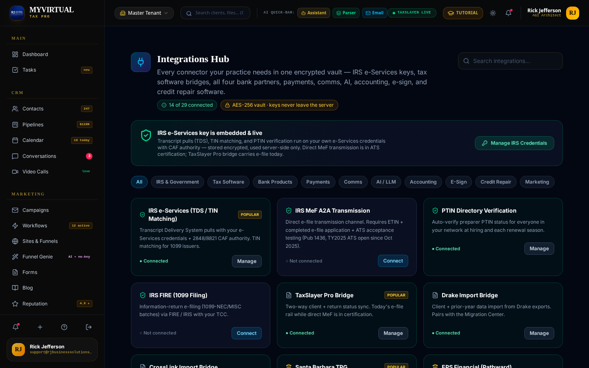

One encrypted vault for every credential: **IRS e-Services (TDS transcripts, TIN matching, CAF)**, MeF A2A certificates, FIRE/IRIS TCC, all four bank partners, Stripe/Square/PayPal, Twilio/SendGrid/Mailgun, OpenAI/Anthropic, QuickBooks/Xero, DocuSign + built-in e-sign, credit repair software, Meta/Google ads, and Zapier via your API key. AES-256 at rest, server-side use only, full audit logging.

### 21.6 Migration Center (`/migration`)
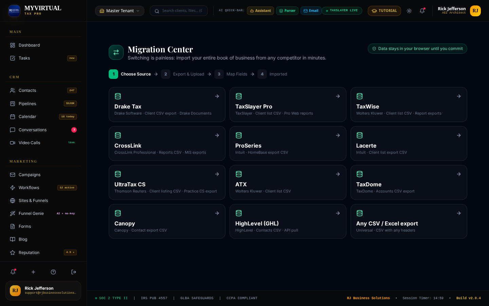

Import a full book of business from **Drake, ProSeries, Lacerte, UltraTax, TaxWise, CrossLink, TaxSlayer Pro, ATX, TaxDome, Canopy, GoHighLevel or raw CSV** — per-platform export instructions, automatic field mapping, duplicate skip, SSN masked to last-4, source tagging.

### 21.7 Developer Hub (`/developer`)
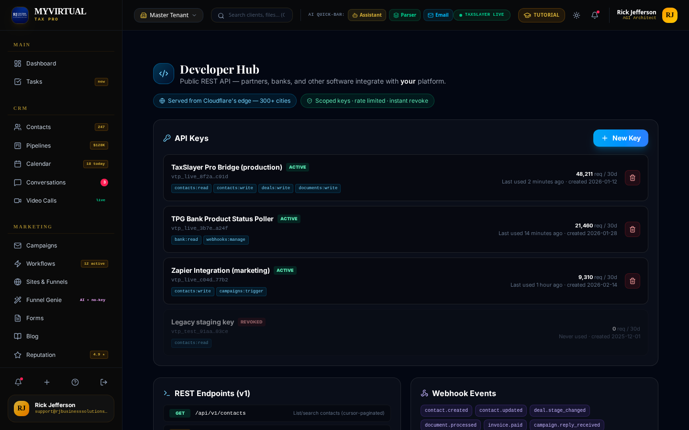

Scoped API keys (`vtp_live_…`, shown once, SHA-256 hashed), full `/api/v1` REST documentation, HMAC-signed webhooks, and the honest e-file roadmap (TaxSlayer Pro bridge today; direct IRS MeF A2A in ATS certification per Pub 1436).

---

## 22. Multi-Tenant Provisioning — Two Paths to a Branded Platform

### 22.1 Self-Serve Onboarding (`/onboard` · public link `/#/signup-company`)
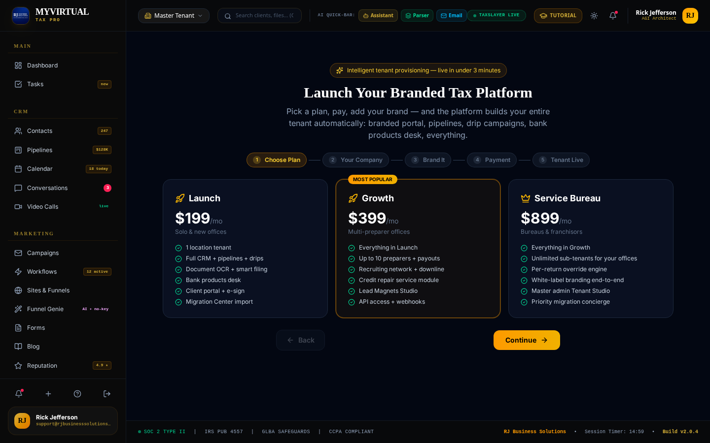

Prospects choose a plan (**Launch $199 / Growth $399 / Service Bureau $899 per month**), enter company info, upload a logo, pick brand colors with a live portal preview, and pay. The provisioning engine then builds their entire tenant automatically — branded portal, pipelines, 8 drip sequences, bank products desk, client portal, e-sign — on their own subdomain in under 60 seconds.

### 22.2 Tenant Studio — Master Admin (`/tenant-studio`)
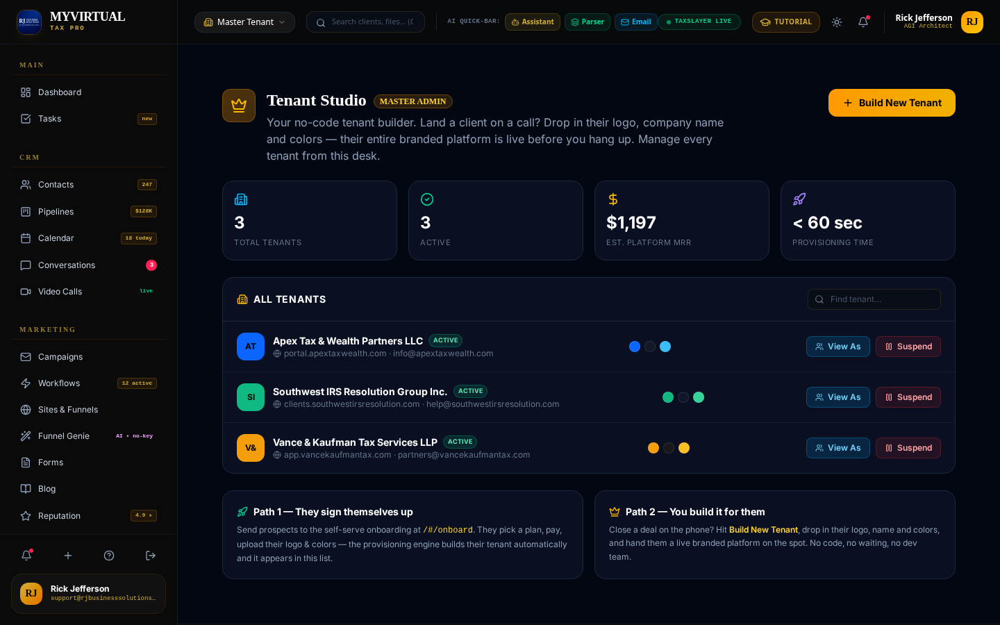

The platform owner's no-code desk. **Build New Tenant** takes a client's logo, company name and colors and provisions their fully-branded platform on the spot — no code, no dev team. Manage every tenant: suspend/reactivate, re-brand, and **View As** impersonation to see exactly what any tenant sees.

---

*© 2026 RJ Business Solutions. This manual accompanies Tax Pro Hub University v2.0.4. Redistribution permitted to licensed service-bureau resellers with white-label rebranding.*
